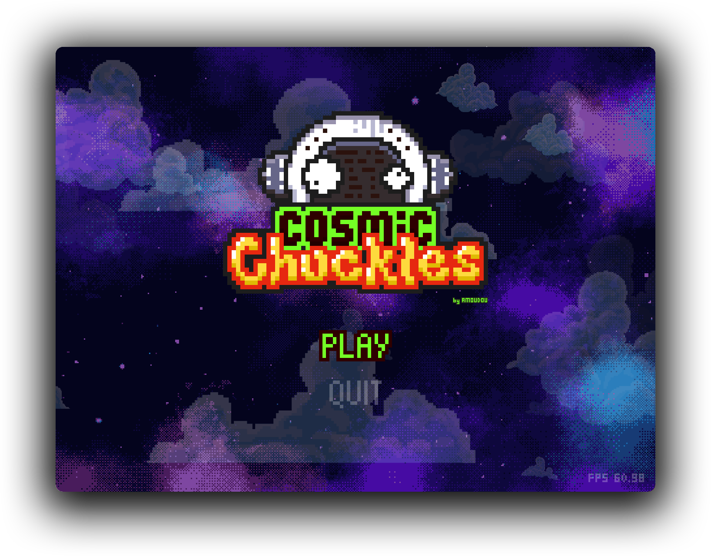
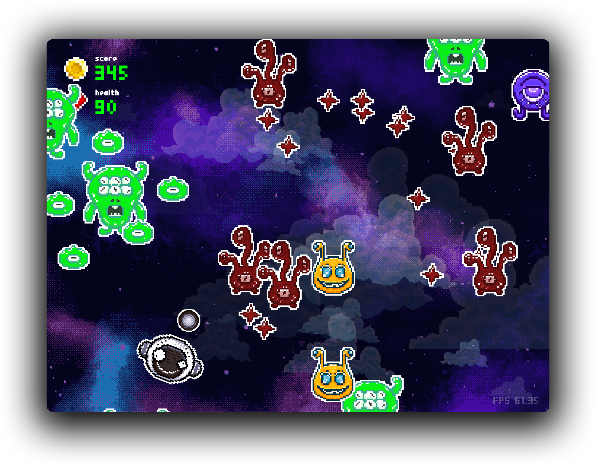

# 

Welcome to the starry and wacky world of Cosmic Chuckles! 🛸💫

## 📜 Table of Contents

- [🌟 Game Overview](#-game-overview)
- [📦 Dependencies](#-dependencies)
- [📥 Installation](#-installation)
- [🎮 How to play](#-how-to-play)
- [🤝 Contributing](#-contributing)
- [🤖 Credits](#-credits)
- [📫 Contact](#-contact)

## 🌟 Game Overview

Cosmic Chuckles is a top-down shooter created with Python's Pygame 🐍🎮 module, offering intergalactic laughter as you battle quirky enemies across the cosmos.

This game should be able to run seamlessly on most major platforms. Enjoy! 🚀🌌

## 📦 Dependencies

- Python 3.11.3
- Pygame 2.5.0
- ModernGL 5.8.2

## 📥 Installation

1. Clone this repository to your local machine using `git clone https://github.com/Adhavane/cosmic-chuckles.git`.
2. Install the dependencies using `pip install -r requirements.txt`.
3. Launch the game by running `python main.py`.
4. Prepare for takeoff! 🚀

## 🎮 How to play

1. Use the arrow keys to navigate your spaceship.
2. Press the **Spacebar** to fire your laughter-powered bullets.
3. Dodge incoming attacks and take down enemies with your cosmic humor.

| Key              | Action        |
| ---------------- | ------------- |
| <kbd>↑</kbd>     | Move forward  |
| <kbd>↓</kbd>     | Move backward |
| <kbd>←</kbd>     | Move left     |
| <kbd>→</kbd>     | Move right    |
| <kbd>🖱️</kbd>     | Aim           |
| <kbd>Space</kbd> | Shoot         |
| <kbd>Esc</kbd>   | Pause         |

## 🤝 Contributing

We're excited to welcome contributions, address issues, and hear your feature requests! Please feel free to check out our open tasks and issues for a list of proposed features and known challenges. We're always looking for ways to enhance the game and make it even more enjoyable.

If you'd like to get involved, we have a handy CONTRIBUTING.md file that provides details on how to submit pull requests. Your ideas and contributions can help shape the cosmic chucklescape into something truly out-of-this-world!

## 🤖 Credits

For more information about the invaluable resources that made this interstellar escapade a reality, take a detour to the CREDITS.md file.

Your cosmic journey through the stars owes its existence to these remarkable tools and resources! 🚀🌌

## 📫 Contact

Have questions, feedback, or just want to share your best space-themed joke? Feel free to reach out if you manage to decipher the secret intergalactic communication frequencies!

We'd love to hear from you and explore the cosmic wonders of your thoughts and ideas.
